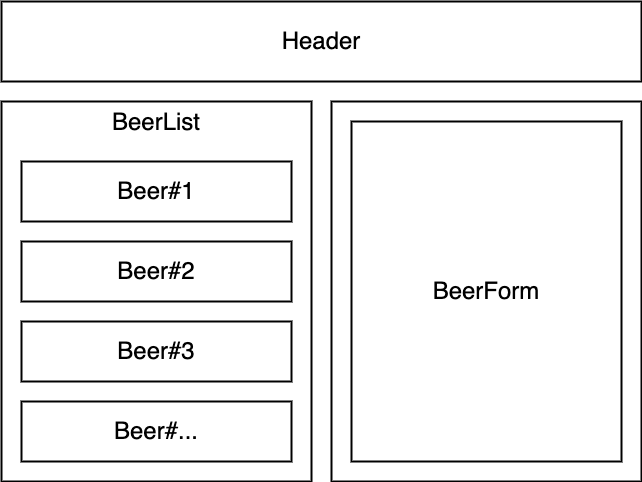

### Technologies Used

* JavaScript
* Node.js
* React
* Bootstrap

## Description

This site lets the user finally track how many bottles of beer are on the wall.

Upon loading the page, there is a button for adding a new beverage. This provides a form with fields for name, type and quantity. Name and type can be anything, so the user can input anything, beer or beverage or otherwise.

Each submitted drink is displayed as a button after the form is submitted. Clicking the button opens the details page which displays the number of bottles of beer on the wall. Clicking the dropdown arrow on the right of the button allows the user to delete the specified drink.

On the details page, the "Take one down" button decreases the number of beers on the wall. This can be done indefinitely, even into the negatives. Although this may seem like a bug, it's meant to account for the possibility that the user is jynxed, and owes someone a Coke. This would potentially leave them with fewer than 0 drinks.

To commit the number of beers on the wall, the user has to click the "Pass it around" button, which will pass the beers around and subsequently reduce the number of beers on the wall.

## Setup/Installation Requirements

* Clone this repository from https://github.com/Di-Falco/code-review-13.git to your desktop
* Navigate to the top level of the directory
* In your terminal console `$cd to code-review-13`
* `$npm install`
* `$npm run start`

## Available Scripts

In the project directory, you can run:

### `npm start`

Runs the app in the development mode.\
Open [http://localhost:3000](http://localhost:3000) to view it in your browser.

The page will reload when you make changes.\
You may also see any lint errors in the console.

### `npm test`

Launches the test runner in the interactive watch mode.\
See the section about [running tests](https://facebook.github.io/create-react-app/docs/running-tests) for more information.

### `npm run build`

Builds the app for production to the `build` folder.\
It correctly bundles React in production mode and optimizes the build for the best performance.

The build is minified and the filenames include the hashes.\
Your app is ready to be deployed!

See the section about [deployment](https://facebook.github.io/create-react-app/docs/deployment) for more information.

## Known Bugs

* None
